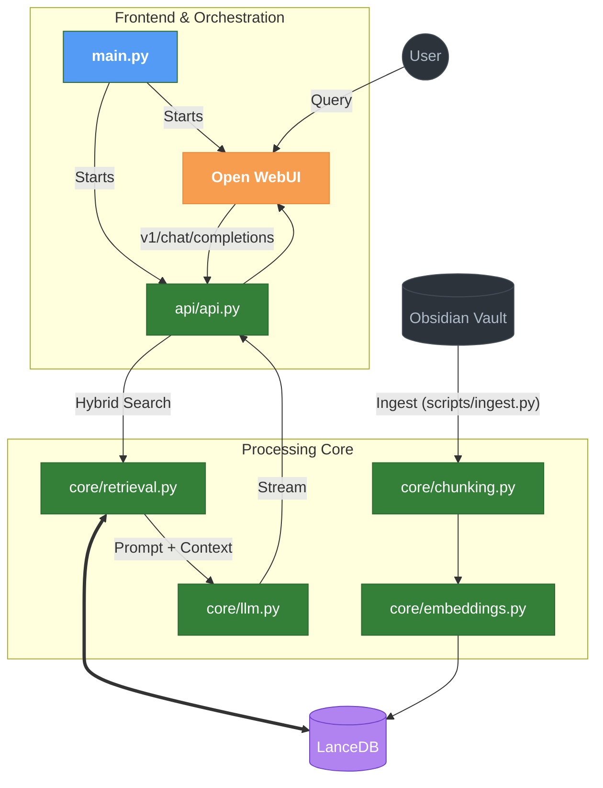

# 📚 Obsidian RAG

A professional, local-first RAG assistant for querying your personal Obsidian vault. This project goes beyond basic vector search by implementing **hybrid retrieval** (semantic + BM25) and **Reciprocal Rank Fusion (RRF)** to provide high-accuracy context for local LLMs.

Everything runs 100% locally — no API keys, no cloud, and no data leaves your machine.

---

## 🚀 Key Value Proposition

Most RAG implementations fail on technical notes because pure semantic search struggles with specific terms, code snippets, and acronyms. This system solves that by:
- **Hybrid Retrieval**: Parallel execution of Vector Similarity (dense) and BM25 (lexical/keyword) search.
- **RRF Fusion**: Merging multiple search results into a single, high-relevance ranking.
- **Modern UX**: A professional ChatGPT-like interface via **Open WebUI** with full **Streaming** support.

---

## 🏗️ Architecture

The system is built as a modular suite of microservices managed by a central orchestrator:

- **Ingestion Pipeline**: Incrementally indexes `.md` files, detecting new, modified, or deleted content. Uses markdown header-aware chunking to preserve logical structure.
- **FastAPI Gateway**: An OpenAI-compatible API serving as the brain of the operation, handling hybrid search, context building, and conversational memory.
- **Local Orchestrator**: A unified launcher (`main.py`) that manages the lifecycle of the backend and frontend services.

### 📊 System Flow



---

## 🗺️ Roadmap: The Path to Agentic RAG

The project is evolving through four distinct phases of development.

### ✅ Phase 1: Core & Hybrid Systems (Complete)
- [x] **Incremental Ingestion**: Synchronization based on file modification dates.
- [x] **Hybrid Search**: Semantic + BM25 keyword search.
- [x] **RRF Fusion**: Reciprocal Rank Fusion for combined rankings.
- [x] **SSE Streaming**: Typing animation/streaming responses in the UI.
- [x] **Conversational Memory**: Automatic context extraction from chat history.

### 🧠 Phase 2: Advanced RAG Refinement (In Progress)
- [ ] **Cross-Encoder Re-ranking**: Using `ms-marco-MiniLM` to pick the best Top-5 from RRF results.
- [ ] **Parent Document Retrieval**: Providing the LLM with full sections instead of isolated chunks.
- [ ] **Multi-format Support**: Native PDF ingestion and processing.
- [ ] **Live Watcher**: Background file-system events for real-time indexing.

### ⚡ Phase 3: Intelligence & Agility (Planned)
- [ ] **Query Expansion**: Using LLM to generate search variations.
- [ ] **HyDE**: Hypothetical Document Embeddings for better query alignment.
- [ ] **Metadata Filtering**: Scoped searching using Obsidian #tags and folders.

### 🤖 Phase 4: Agentic Evolution (Future)
- [ ] **Internet Search**: Tool calling for real-time external knowledge.
- [ ] **Writing Agent**: Autonomous note creation and modification.
- [ ] **Self-Reflection**: Verification loop for answer accuracy.

---

## 🛠️ Getting Started

### 1. Setup
1. Clone the repository.
2. Create and activate a environment (Conda/Venv):
   ```bash
   conda create -n AI_RAG python=3.12
   conda activate AI_RAG
   ```
3. Install dependencies:
   ```bash
   pip install -r requirements.txt
   ```
4. Update `config.py` with your `VAULT_PATH`.

### 2. Usage
**First Indexing:**
```bash
python scripts/ingest.py
```

**Run the Platform:**
```bash
python main.py
```
Access the dashboard at `http://localhost:8080`.

---

## ⚙️ Tech Stack

| Component | Choice | Why |
|-----------|--------|-----|
| **Vector DB** | LanceDB | Embedded, ultra-fast, native Full-Text Search index. |
| **Embeddings** | bge-large-en-v1.5 | SOTA performance / GPU optimized. |
| **LLM Backend** | LM Studio | OpenAI-compatible server for local inference. |
| **Orchestrator** | Python / Subprocess | Controlled management of FastAPI and WebUI. |

---

## ⚖️ License
MIT
