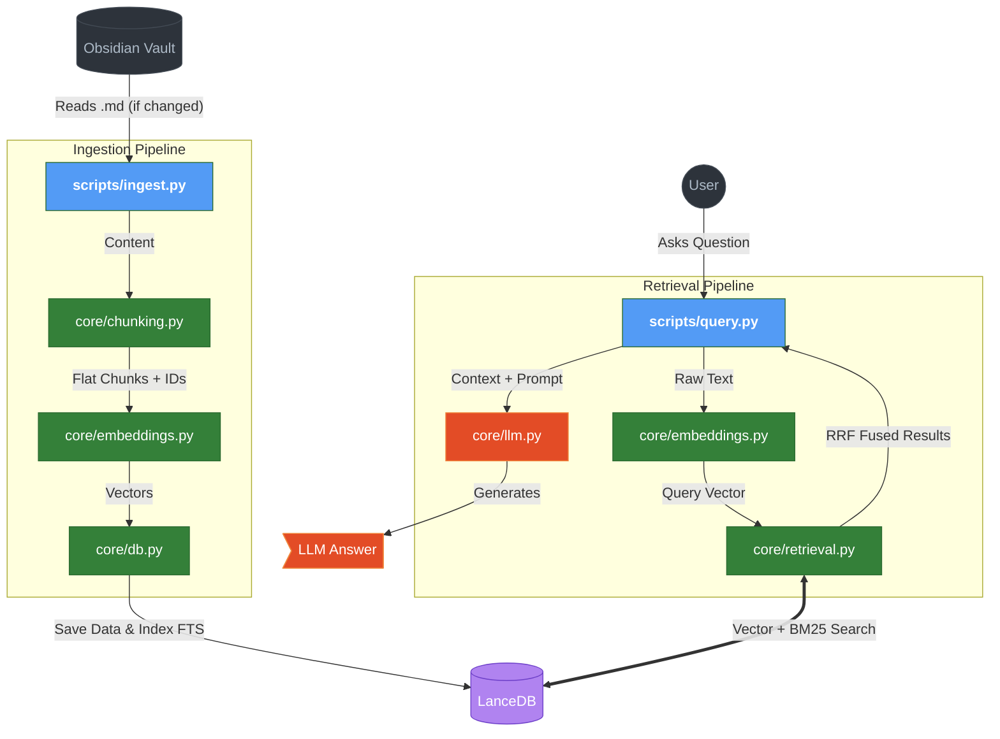

# 📚 Obsidian RAG

> ⚠️ **Work in Progress** — Modular refactor in progress

A local-first RAG assistant for querying my personal Obsidian vault. Instead of relying on basic vector search like most RAG implementations, this project uses **hybrid retrieval** (semantic + BM25) combined with **Reciprocal Rank Fusion** to improve result relevance before sending context to a local LLM.

Everything runs locally — no API keys, no cloud, no data leaving my machine.

## Why This Project

Most RAG tutorials stop at "embed → vector search → LLM". This misses a lot of relevant results because pure semantic search struggles with exact terms, names, and acronyms. By combining dense vectors with BM25 lexical search and fusing with RRF, retrieval quality improves significantly — especially for technical notes mixing code, formulas, and natural language.

## Architecture

The project follows a modular design with two main pipelines:

**Ingestion** — Reads `.md` files from an Obsidian vault, detects changes (new/modified/deleted), chunks by markdown headers, generates embeddings, and stores everything in LanceDB with a full-text search index.

**Retrieval** — Takes a user query, runs parallel vector + BM25 searches, fuses results with RRF, builds a context string, and sends it to a local LLM (RNJ-1 via LM Studio) for answer generation.

## Current Status

### ✅ Implemented
- Ingestion pipeline with incremental change detection (new/modified/deleted files)
- Refactored `scripts/ingest.py` to use modular `core/` components (no duplicated logic)
- Markdown chunking by headers (`h1`, `h2`, `h3`) with empty chunk filtering
- Deterministic chunk IDs via content hashing
- Embedding generation with `bge-large-en-v1.5` (GPU)
- LanceDB storage with native full-text search index
- Hybrid search: vector similarity + BM25
- RRF fusion with hash-based document IDs
- LLM integration via LM Studio (OpenAI-compatible API)
- Modular `core/` package: `db.py`, `chunking.py`, `embeddings.py`, `retrieval.py`, `llm.py`
- CLI query script (`scripts/query.py`)
- Centralized configuration (`config.py`)
- Removed deprecated monolithic search script (`core/search.py`)
- **FastAPI endpoint** (`api/api.py`) exposing OpenAI-compatible endpoints (`/v1/chat/completions`, `/v1/models`)
- **Open WebUI integration** for a polished chat interface with **Streaming (SSE)**
- **Conversational memory** context extraction

### 📋 Phase 1: Core Systems
- [x] Ingestion pipeline with change detection
- [x] Hybrid search & RRF fusion
- [x] LLM integration & Modular refactoring

### 🧠 Phase 2: Memory & Refinement (Current)
- [x] Conversational memory (chat history support)
- [ ] Cross-encoder re-ranking (`ms-marco-MiniLM`) and confidence thresholds
- [ ] File watcher (`watchdog`) for auto-syncing vault changes
- [ ] Unit and integration tests

### 🌐 Phase 3: Production UI
- [x] FastAPI endpoint for programmatic access
- [x] Open WebUI integration for a polished chat interface

### 🤖 Phase 4: Agentic Evolution
- Multi-modal document support (PDF, Word)
- Internet access via Tool Calling (e.g., DuckDuckGo API)
- Autonomous Note Creation / Modification (Writing Agents with Human-in-the-loop)

## Architecture Flow

## Tech Stack

| Component | Choice | Why |
|-----------|--------|-----|
| Vector DB | LanceDB | Embedded, no server needed, native FTS support |
| Embeddings | bge-large-en-v1.5 | Top MTEB benchmark, 1024 dims |
| LLM | RNJ-1 8B via LM Studio | Good at code/STEM, runs locally on RTX 4080 |
| Chunking | LangChain MarkdownHeaderTextSplitter | Preserves document structure |

## License

MIT
